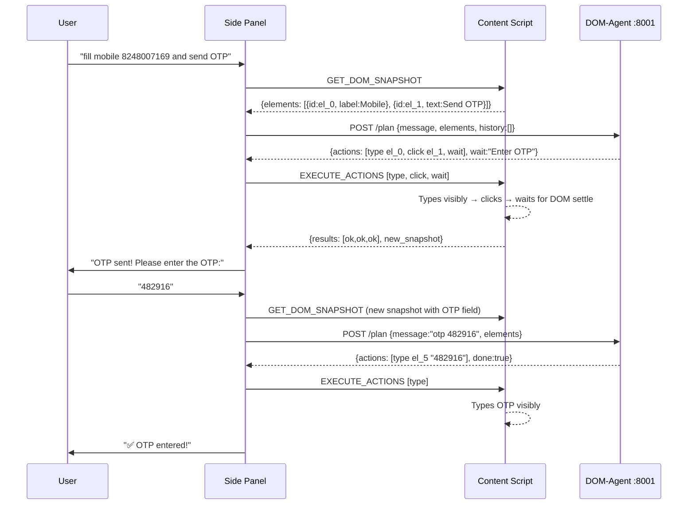

# Frontend-Interactive Agent — Revised Architecture Plan (v2)

> Addresses all 12 review points + user directives: **separate backend**, **configurable params**, **shared extension**.

## Directory Structure

```
browser/
  backend/           ← EXISTING: browser-use headless backend (untouched)
  dom-agent/          ← NEW: DOM-interactive planner backend
    main.py           ← FastAPI server (port 8001)
    planner.py        ← LLM action planner
    schemas.py        ← DOMElement, DOMAction, PlanRequest/Response
    config.py         ← Configurable parameters (max_elements, delays, etc.)
    safety.py         ← Action safety layer
    requirements.txt
    .env
  extension/          ← SHARED: Chrome extension (talks to both backends)
    manifest.json
    background/background.js     ← Routes to port 8000 or 8001
    content_scripts/content.js   ← DOM reader + executor + state observer
    side_panel/panel.js          ← Orchestration loop
    side_panel/panel.html
    side_panel/panel.css
    popup/options.html + .js
```

> [!IMPORTANT]
> Two separate backends, one shared extension. Extension routes:
> - `/chat`, `/automate` → `localhost:8000` (browser-use backend)
> - `/plan` → `localhost:8001` (DOM-agent backend)

---

## Configurable Parameters — `config.py`

```python
class AgentConfig(BaseSettings):
    max_elements: int = 50           # Adjustable DOM snapshot cap
    max_actions_per_batch: int = 10  # Max actions LLM returns per batch
    type_delay_min_ms: int = 50      # Human-like typing min delay
    type_delay_max_ms: int = 130     # Human-like typing max delay
    dom_settle_timeout_ms: int = 3000
    network_idle_ms: int = 500
    mutation_settle_ms: int = 300
    loop_detection_window: int = 5   # Track last N action batches
    loop_abort_threshold: int = 3    # Abort after N repeated batches
    llm_model: str = "gemini/gemini-2.5-flash"
```

All configurable via [.env](file:///d:/Mini-proj/ghmc/Browser-automation-chatbot/browser/backend/.env) or API.

---

## Core Design (All 12 Points Addressed)

### 1. Element Abstraction Layer (Point #1, #12)

Content script assigns stable `el_0..el_N` IDs. LLM references `element_id` only.

```json
{ "id": "el_0", "tag": "input", "label": "Mobile No. for OTP", "name": "txtMobile" }
```

Selector priority: [id](file:///d:/Mini-proj/ghmc/Browser-automation-chatbot/browser/extension/side_panel/panel.js#66-71) → [name](file:///d:/Mini-proj/ghmc/Browser-automation-chatbot/browser/backend/schemas.py#50-58) → `aria-label` → `data-testid` → `unique text` → `nth-of-type`

### 2. Multi-Step Batched Planning (Point #2)

LLM returns full action batch. Executor runs all actions locally — no per-step backend calls.

### 3. Filtered DOM — Configurable Cap (Point #3)

Only interactive elements (`input`, `button`, `select`, `textarea`, `a[href]`). Capped at `max_elements` (configurable, default 50). Priority: visible > enabled > with-label.

### 4. Loop Detection (Point #4)

Track last `loop_detection_window` batches. If same action sequence repeats `loop_abort_threshold` times → abort + ask user.

### 5. State Observers (Point #5, #6)

`MutationObserver` + network idle + hard timeout. Executor calls `waitForStable()` between actions.

### 6. Action Safety Layer (Point #7)

Allowlisted: `type`, [click](file:///d:/Mini-proj/ghmc/Browser-automation-chatbot/browser/extension/side_panel/panel.js#176-177), `select`, `scroll`, `wait`, [navigate](file:///d:/Mini-proj/ghmc/Browser-automation-chatbot/browser/backend/prompts.py#126-148), `done`.  
Blocked: password fields, payment forms, file uploads, destructive actions. Enforced in content script.

### 7. OTP Detection (Point #8)

Rule-based in content script: checks `maxlength`, [name](file:///d:/Mini-proj/ghmc/Browser-automation-chatbot/browser/backend/schemas.py#50-58), `placeholder`, `pattern` for OTP hints. Pauses and asks user.

### 8. No Hybrid — Fully Separate (Point #9)

DOM-agent is a completely separate backend. No shared state with browser-use. Extension routes to the correct backend.

### 9. Human-Like Events + Jitter (Point #10)

`KeyboardEvent` → `InputEvent` → `change` with configurable timing jitter.

### 10. JSON Schema Enforcement (Point #11)

Pydantic `PlanResponse` validation. Retry once with stricter prompt on non-JSON output.

---

## File Changes

### NEW: `browser/dom-agent/`

| File | Purpose |
|------|---------|
| [main.py](file:///d:/Mini-proj/ghmc/Browser-automation-chatbot/browser/backend/main.py) | FastAPI on port 8001, `POST /plan`, `GET /health`, `GET /config` |
| `planner.py` | LLM planner: DOM snapshot → `DOMAction[]` with session context |
| [schemas.py](file:///d:/Mini-proj/ghmc/Browser-automation-chatbot/browser/backend/schemas.py) | `DOMElement`, `DOMAction`, `PlanRequest`, `PlanResponse` |
| `config.py` | [AgentConfig(BaseSettings)](file:///d:/Mini-proj/ghmc/Browser-automation-chatbot/browser/backend/agent.py#56-74) — all adjustable params |
| `safety.py` | Action validation, blocked field detection |
| [requirements.txt](file:///d:/Mini-proj/ghmc/Browser-automation-chatbot/browser/backend/requirements.txt) | `fastapi`, `uvicorn`, `litellm`, `langchain`, `pydantic`, `python-dotenv` |

### MODIFY: `browser/extension/`

| File | Change |
|------|--------|
| `content.js` | Add Element Abstraction Layer + DOM Executor + State Observer |
| `panel.js` | Add action loop orchestration, route `/plan` to port 8001 |
| `panel.html` | Add step progress indicator + OTP prompt component |
| `background.js` | Add routing for dom-agent backend (port 8001) |

### UNTOUCHED: `browser/backend/`

Existing browser-use headless backend stays as-is.

---

## Communication Flow



---

## Verification Plan

### Phase 1 — Planner
1. Start dom-agent: `uvicorn main:app --port 8001`
2. `curl POST /plan` with mock DOM → verify JSON actions with `element_id` refs

### Phase 2 — Executor
1. Reload extension → open any form page
2. Type "fill this form" → verify visible typing + clicking

### Phase 3 — OTP Flow
1. GHMC Function Hall → "fill mobile and send OTP"
2. Verify: visible type → click → pause → user enters OTP → visible type
