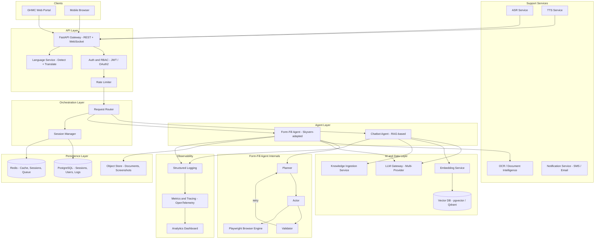
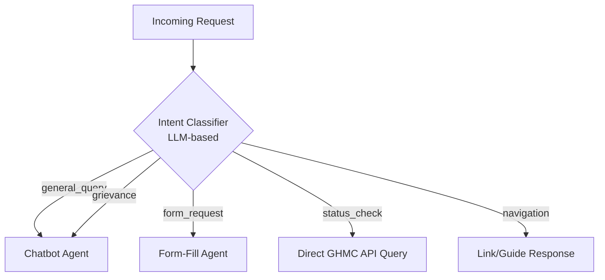
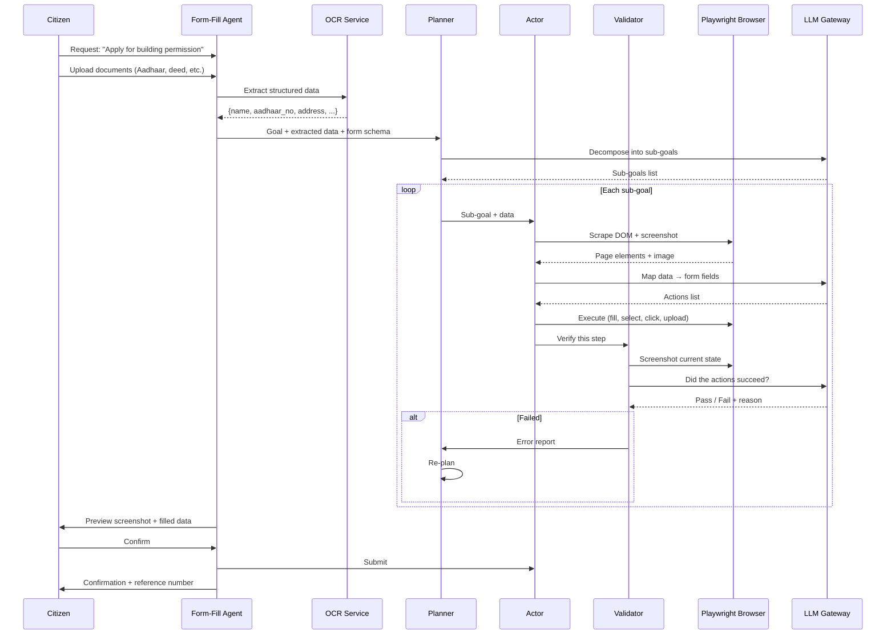
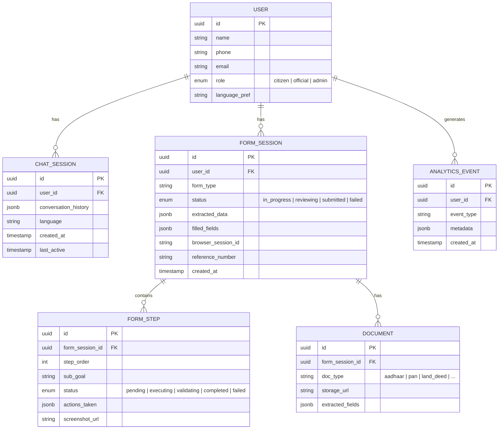
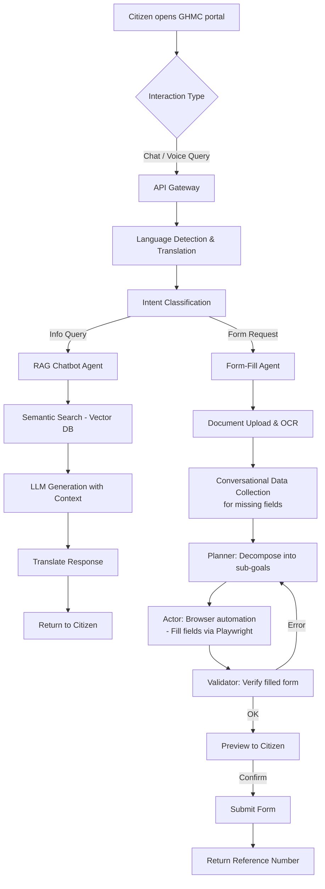
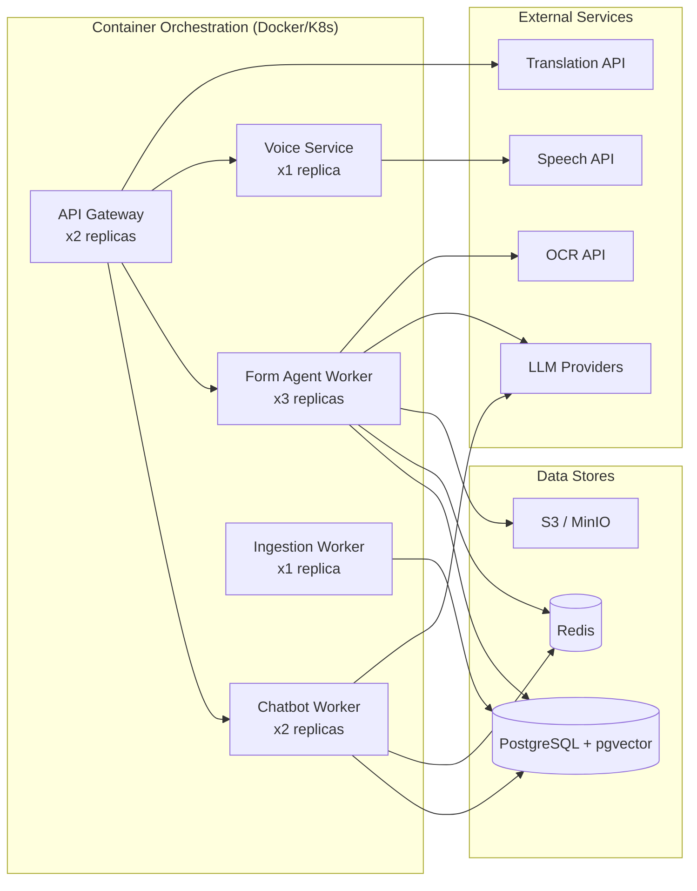

# Backend Architecture – High-Level Design (HLD)

**GHMC AI-Enabled Digital Services Platform**
**Version:** 1.0 | **Date:** 2026-02-27 | **Status:** Draft / Reference

---

## 1. Overview

This document describes the backend architecture for the GHMC AI platform comprising two core capabilities:

1. **AI-Powered Chatbot** – RAG-based conversational assistant for citizens and officials
2. **AI-Based Form Filling** – Intelligent browser automation agent that fills GHMC portal forms on behalf of citizens

The backend adopts **Skyvern's Planner-Actor-Validator agent pattern** for the form-fill engine and a **LangChain/LlamaIndex RAG pipeline** for the chatbot.

---

## 2. Architecture Principles

| Principle | Description |
|---|---|
| **Modular & Extensible** | Each subsystem (chatbot, form agent, OCR, voice) is an independent, swappable service |
| **Agent-Oriented** | Form automation uses an autonomous agent loop (plan → act → validate) |
| **API-First** | All capabilities exposed via RESTful + WebSocket APIs |
| **Async-Native** | Python `asyncio` + task queues for non-blocking browser and LLM operations |
| **Multi-LLM** | Provider-agnostic LLM gateway supporting OpenAI, Gemini, Anthropic, Azure, Ollama |
| **Secure by Default** | RBAC, encryption in transit/at rest, Indian data-protection compliance |

---

## 3. High-Level Architecture Diagram

---

## 4. Backend Component Breakdown

### 4.1 API Gateway (FastAPI)

| Concern | Detail |
|---|---|
| **Framework** | FastAPI (Python 3.11+) |
| **Protocols** | REST for CRUD; WebSocket for real-time chat & form-fill progress streaming |
| **Auth** | JWT-based; RBAC roles: `citizen`, `official`, `admin` |
| **Endpoints (key)** | `POST /chat`, `WS /chat/stream`, `POST /form/start`, `POST /form/upload-docs`, `WS /form/progress`, `GET /analytics/...` |

### 4.2 Request Router

Routes incoming requests to the appropriate agent based on **intent classification**:

**Intent categories:**

| Intent | Description | Routed To |
|---|---|---|
| `general_query` | Questions about GHMC services, policies, schemes | Chatbot Agent |
| `form_request` | "I want to apply for…", "Help me fill…" | Form-Fill Agent |
| `grievance` | Complaint submission or status | Chatbot Agent → Grievance API |
| `status_check` | Application tracking | Direct API lookup |
| `navigation` | "Where do I find…" | Static link resolver |

### 4.3 Session Manager

Manages conversation and form-fill session state:

- **Chat sessions** – Conversation history, context window, language preference
- **Form sessions** – Current form step, extracted data, browser session ID, validation state
- **Storage** – Redis (hot cache, TTL = 30 min) + PostgreSQL (durable)

### 4.4 Chatbot Agent

> Detailed in [03_knowledge_ingestion_rag_hld.md](./03_knowledge_ingestion_rag_hld.md)

| Aspect | Detail |
|---|---|
| **Architecture** | RAG pipeline (retrieve-then-generate) |
| **Retriever** | Semantic search over GHMC knowledge base via vector DB |
| **Generator** | LLM with conversation history + retrieved context |
| **Memory** | Sliding-window conversation buffer (last N turns) |
| **Handoff** | Can redirect to form-fill agent when form intent detected |

### 4.5 Form-Fill Agent (Skyvern-Adapted)

The core form-fill engine uses a **Planner → Actor → Validator** agent loop adapted from Skyvern's `ForgeAgent`:

**Key components adapted from Skyvern:**

| Skyvern Component | GHMC Adaptation |
|---|---|
| `ForgeAgent` class | `GHMCFormFillAgent` – adds OCR integration, conversational data collection, GHMC form schemas |
| `LLMAPIHandlerFactory` | Reused directly – multi-provider LLM abstraction |
| `PromptEngine` | Customized prompt templates for GHMC-specific form instructions |
| Action types (`InputTextAction`, `SelectOptionAction`, `ClickAction`, `UploadFileAction`) | Reused directly |
| `WorkflowRun` | Multi-form chaining (e.g., application → payment → receipt) |
| DOM scraping + screenshots | Reused directly for GHMC portal pages |

### 4.6 OCR / Document Intelligence Service

| Aspect | Detail |
|---|---|
| **Purpose** | Extract structured data from citizen documents (Aadhaar, PAN, land deeds, etc.) |
| **Technology** | Azure AI Document Intelligence / Google Document AI / Tesseract + custom models |
| **Input** | Scanned images, PDFs, photos |
| **Output** | JSON: `{name, dob, aadhaar_no, address, plot_no, ...}` |
| **Validation** | Cross-check extracted fields with known patterns (e.g., Aadhaar = 12 digits) |

### 4.7 Language Service

| Aspect | Detail |
|---|---|
| **Languages** | Telugu, Hindi, Urdu, English |
| **Detection** | `langdetect` / `fasttext` language identification |
| **Translation** | IndicTrans2 (open-source, Indian languages) or Google Translate API |
| **Flow** | Incoming → detect → translate to English (for agents) → process → translate response back |

### 4.8 Voice Services

| Service | Technology Options | Purpose |
|---|---|---|
| **ASR** | Google Cloud Speech / Azure Speech / Bhashini ASR | Voice input → text |
| **TTS** | Google Cloud TTS / Azure Speech / Bhashini TTS | Text response → audio |
| **Integration** | WebSocket streaming for real-time voice I/O | Low-latency interaction |

### 4.9 LLM Gateway

Centralized LLM access layer (adapted from Skyvern's `LLMAPIHandlerFactory`):

| Feature | Detail |
|---|---|
| **Providers** | OpenAI, Gemini, Anthropic, Azure OpenAI, Ollama (local), OpenRouter |
| **Routing** | Different models for different tasks (cheap model for intent classification, powerful model for form reasoning) |
| **Fallback** | Primary → Secondary provider failover |
| **Caching** | Response caching for identical prompts (Redis) |
| **Rate Limiting** | Per-provider token/request limits |

---

## 5. Data Model (Core Entities)

---

## 6. API Design (Key Endpoints)

### 6.1 Chat APIs

| Method | Endpoint | Description |
|---|---|---|
| `POST` | `/api/v1/chat` | Send a chat message, get response |
| `WS` | `/api/v1/chat/stream` | WebSocket for streaming chat |
| `GET` | `/api/v1/chat/sessions/{id}/history` | Retrieve conversation history |

### 6.2 Form-Fill APIs

| Method | Endpoint | Description |
|---|---|---|
| `POST` | `/api/v1/form/start` | Start a new form-fill session |
| `POST` | `/api/v1/form/{session_id}/upload-docs` | Upload documents for OCR extraction |
| `POST` | `/api/v1/form/{session_id}/fill` | Trigger the form-fill agent |
| `WS` | `/api/v1/form/{session_id}/progress` | Stream form-fill progress (screenshots, status) |
| `POST` | `/api/v1/form/{session_id}/confirm` | Confirm and submit the form |
| `GET` | `/api/v1/form/{session_id}/status` | Get form session status |

### 6.3 Voice APIs

| Method | Endpoint | Description |
|---|---|---|
| `WS` | `/api/v1/voice/stream` | Bidirectional voice streaming (ASR → process → TTS) |
| `POST` | `/api/v1/voice/transcribe` | One-shot audio transcription |

### 6.4 Admin / Analytics APIs

| Method | Endpoint | Description |
|---|---|---|
| `GET` | `/api/v1/analytics/queries` | Query trends & patterns |
| `GET` | `/api/v1/analytics/usage` | Language & service usage metrics |
| `POST` | `/api/v1/admin/knowledge/ingest` | Trigger knowledge base ingestion |

---

## 7. Processing Flow – End to End

---

## 8. Infrastructure & Deployment

| Aspect | Choice |
|---|---|
| **Containerization** | Docker |
| **Orchestration** | Kubernetes / Docker Compose (dev) |
| **CI/CD** | GitHub Actions / GitLab CI |
| **Monitoring** | OpenTelemetry + Grafana + Prometheus |
| **Log Aggregation** | ELK Stack / Loki |

---

## 9. Security Considerations

| Concern | Mitigation |
|---|---|
| **Authentication** | JWT tokens, OAuth2 for officials |
| **Authorization** | RBAC: `citizen` (limited), `official` (full), `admin` (system) |
| **Data in Transit** | TLS 1.3 everywhere |
| **Data at Rest** | AES-256 encryption for PII (Aadhaar, PAN, etc.) |
| **PII Handling** | Extracted document data encrypted, TTL-based auto-deletion |
| **Browser Sessions** | Sandboxed Playwright instances, no persistent state |
| **API Security** | Rate limiting, input validation, CORS policies |
| **Compliance** | Indian IT Act, DPDP Act 2023, GHMC data policies |

---

## 10. Scalability Notes

- **Form Agent Workers** are the heaviest resource (each runs a Playwright browser). Scale horizontally with K8s HPA.
- **LLM calls** are the latency bottleneck. Use caching, streaming, and model-appropriate routing (cheap models for classification, powerful for form reasoning).
- **Vector DB** scales independently. pgvector for small scale; migrate to Qdrant/Pinecone for large-scale knowledge bases.
- **Redis** handles session state and task queue. Scale with Redis Cluster if needed.
