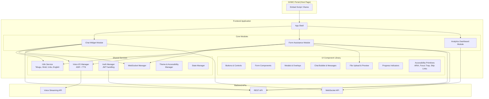
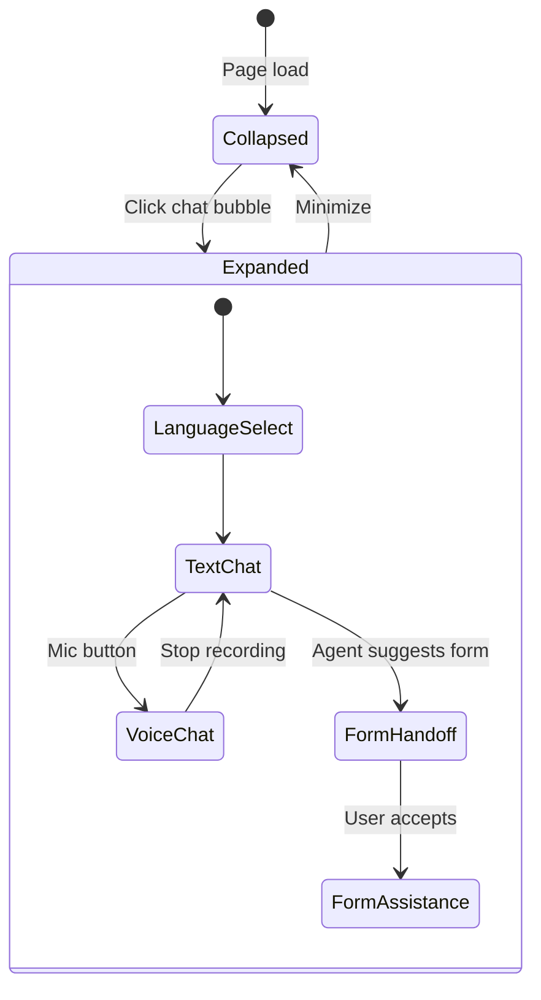
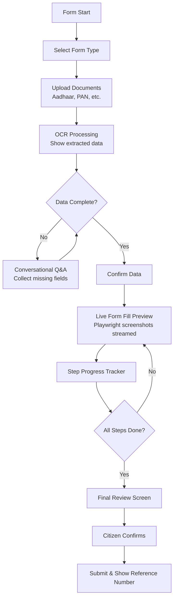
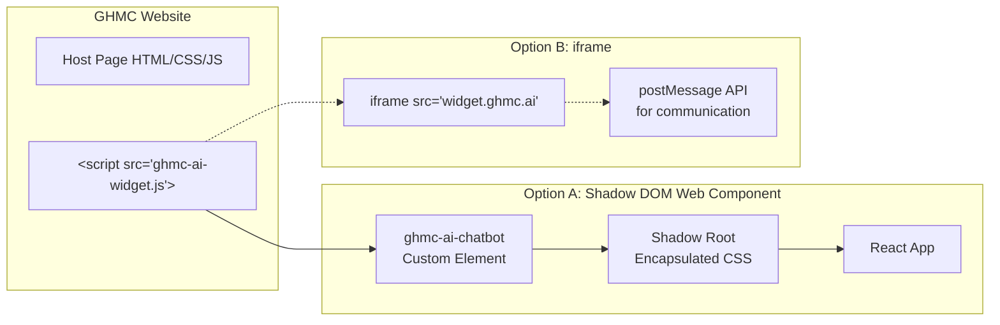
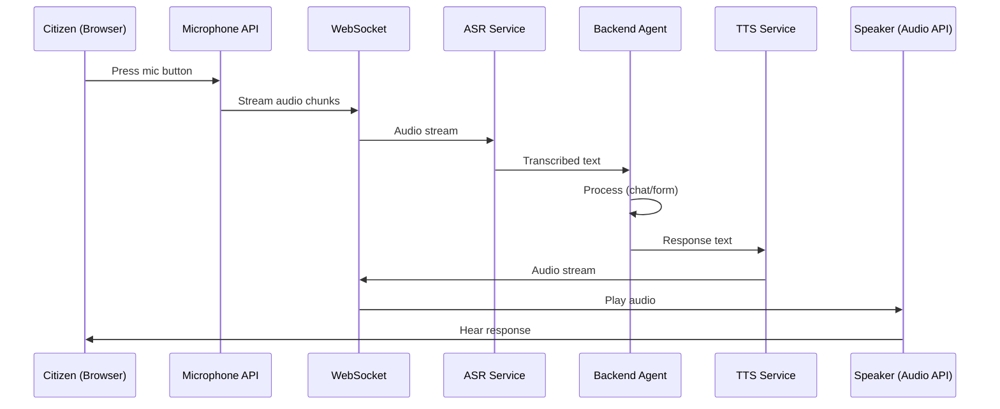

# Frontend Architecture – High-Level Design (HLD)

**GHMC AI-Enabled Digital Services Platform**
**Version:** 1.0 | **Date:** 2026-02-27 | **Status:** Draft / Reference

---

## 1. Overview

The frontend serves as the citizen/official-facing layer embedded within the **GHMC web portal**. It provides:

- **Chat Widget** – Multilingual, voice-enabled conversational interface
- **Form Assistance UI** – Guided form-filling with document upload, live preview, and step tracking
- **Analytics Dashboard** – Admin/official view for query trends and system metrics

The frontend must be **responsive**, **WCAG 2.1/2.2 compliant**, and **embeddable** within the existing GHMC website.

---

## 2. Design Principles

| Principle | Description |
|---|---|
| **Embeddable** | Chat widget and form UI can be injected into any GHMC page via `<script>` tag or iframe |
| **Responsive** | Desktop, tablet, and mobile (min 320px width) |
| **Accessible** | WCAG 2.1 AA minimum; screen reader support, keyboard navigation, high contrast |
| **Multilingual** | UI chrome + content in Telugu, Hindi, Urdu, English; RTL support for Urdu |
| **Progressive** | Core functionality works without JS-heavy features; graceful degradation |
| **Real-Time** | WebSocket-driven streaming for chat and form-fill progress |

---

## 3. Frontend Architecture Diagram

---

## 4. Module Breakdown

### 4.1 Chat Widget Module

The primary citizen interaction point – a floating chat bubble that expands into a full conversational interface.

**Key features:**

| Feature | Implementation |
|---|---|
| **Floating bubble** | Fixed-position widget, z-index above host page |
| **Message types** | Text, rich cards (links, buttons), image previews, form cards |
| **Voice input** | Web Speech API / MediaRecorder → send audio to ASR backend |
| **Voice output** | Backend TTS audio streamed and played via Web Audio API |
| **Typing indicator** | WebSocket-driven real-time streaming of LLM response |
| **Language switcher** | Dropdown in header; persists to localStorage |
| **Conversation history** | Scrollable message list; lazy-loaded from API |

### 4.2 Form Assistance Module

Guides citizens through document upload, data verification, and real-time form-fill preview.

**Key features:**

| Feature | Implementation |
|---|---|
| **Form type selector** | Card-based grid of available GHMC forms |
| **Document upload** | Drag-and-drop zone; image preview; multi-file support |
| **OCR result display** | Editable table showing extracted fields; citizen can correct |
| **Data collection chat** | Inline mini-chat for collecting missing fields conversationally |
| **Live form preview** | Streamed screenshots from Playwright browser via WebSocket |
| **Step tracker** | Vertical stepper showing: Navigate → Fill Details → Upload Docs → Submit |
| **Final review** | Side-by-side: filled form screenshot + extracted data summary |
| **Confirmation** | Submit button + reference number display + download receipt |

### 4.3 Analytics Dashboard Module

For GHMC officials and admins only (role-gated).

| Widget | Data Shown |
|---|---|
| **Query Trends** | Time-series chart of chat queries per day/week |
| **Language Distribution** | Pie chart of queries by language |
| **Top Services** | Bar chart of most-requested services/forms |
| **Resolution Rate** | % of queries resolved without human handoff |
| **Form Completion Rate** | % of form sessions that reached submission |
| **Active Sessions** | Real-time count of active chat/form sessions |

---

## 5. Technology Choices

| Layer | Technology | Rationale |
|---|---|---|
| **Framework** | React 18+ / Next.js | Component-based, large ecosystem, SSR for SEO |
| **State Management** | Zustand / React Context | Lightweight, sufficient for widget-scoped state |
| **Styling** | CSS Modules + Design Tokens | Scoped styles that won't leak into GHMC host page |
| **i18n** | react-i18next | Mature, supports dynamic language switching, RTL |
| **WebSocket** | Native WebSocket + reconnect wrapper | Real-time chat and form-fill streaming |
| **Voice** | Web Speech API + MediaRecorder | Browser-native ASR fallback; MediaRecorder for backend ASR |
| **Accessibility** | Radix UI primitives + custom ARIA | WCAG 2.1 AA compliant components |
| **Charts** | Recharts / Chart.js | Analytics dashboard visualizations |
| **Build** | Vite | Fast builds; outputs single embeddable bundle |
| **Embed** | Web Component wrapper or iframe | Isolation from host page CSS/JS |

---

## 6. Embedding Strategy

The frontend must be embeddable into the existing GHMC website without conflicts:

| Option | Pros | Cons |
|---|---|---|
| **Shadow DOM** | No CSS leakage, single page load, direct DOM access | Slightly complex setup |
| **iframe** | Complete isolation, simpler | Cross-origin issues, separate load, harder auth sharing |

**Recommendation:** Shadow DOM Web Component for the chat widget; iframe only if strict isolation is required.

---

## 7. Voice I/O Flow

---

## 8. Accessibility Requirements (WCAG 2.1 AA)

| Requirement | Implementation |
|---|---|
| **Keyboard Navigation** | All interactive elements focusable; tab order logical; Enter/Space to activate |
| **Screen Reader** | ARIA labels, live regions for chat messages, role attributes |
| **Color Contrast** | Minimum 4.5:1 for text; 3:1 for large text |
| **Focus Indicators** | Visible focus rings on all interactive elements |
| **Text Resize** | UI works at 200% zoom without horizontal scrolling |
| **RTL Support** | Urdu content rendered right-to-left; `dir="rtl"` attribute |
| **Skip Links** | "Skip to chat" / "Skip to form" links for keyboard users |
| **Motion** | Respect `prefers-reduced-motion` media query |

---

## 9. Responsive Breakpoints

| Breakpoint | Width | Layout |
|---|---|---|
| **Mobile** | < 640px | Chat: fullscreen overlay; Form: single-column stack |
| **Tablet** | 640px – 1024px | Chat: side panel (40% width); Form: two-column |
| **Desktop** | > 1024px | Chat: floating panel (400px); Form: three-column with sidebar |

---

## 10. Frontend ↔ Backend Integration

| Interaction | Protocol | Endpoint |
|---|---|---|
| Chat message | WebSocket | `WS /api/v1/chat/stream` |
| Form start | REST | `POST /api/v1/form/start` |
| Document upload | REST (multipart) | `POST /api/v1/form/{id}/upload-docs` |
| Form-fill progress | WebSocket | `WS /api/v1/form/{id}/progress` |
| Form submit | REST | `POST /api/v1/form/{id}/confirm` |
| Voice stream | WebSocket | `WS /api/v1/voice/stream` |
| Analytics data | REST | `GET /api/v1/analytics/...` |
| Auth | REST | `POST /api/v1/auth/login`, `/refresh` |
