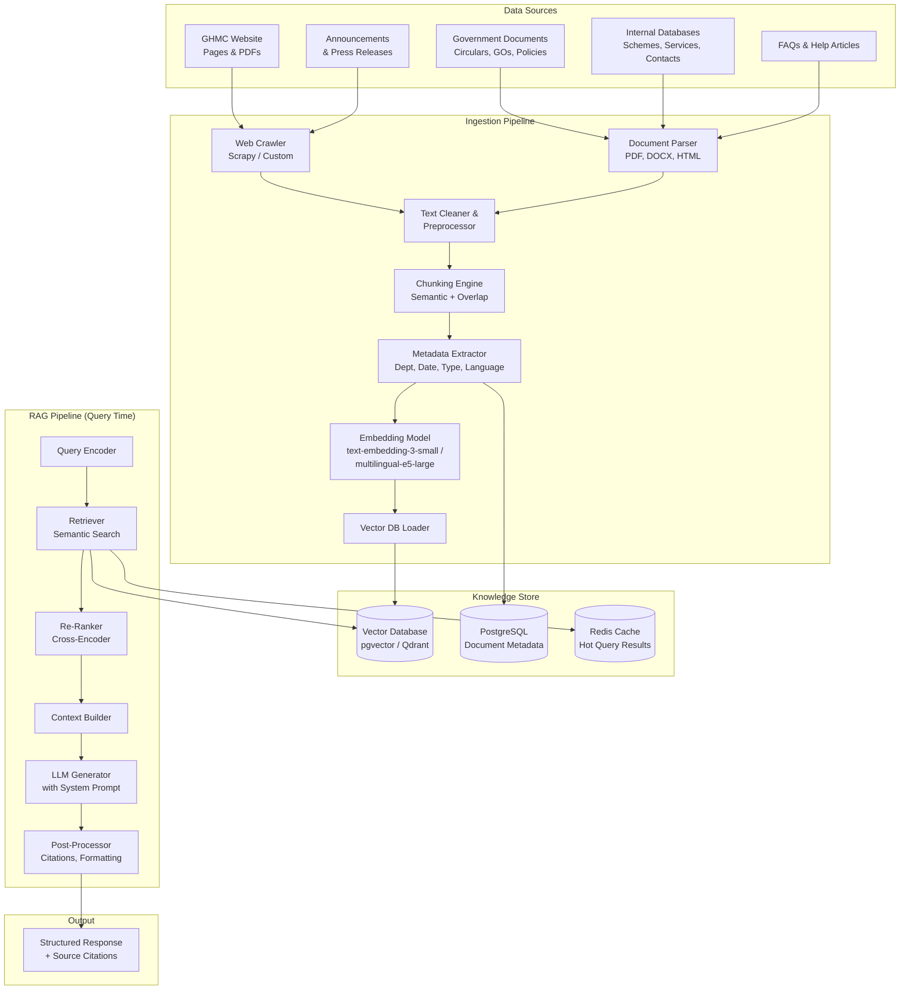
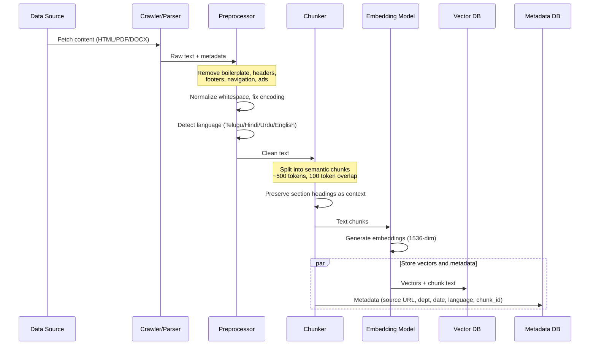
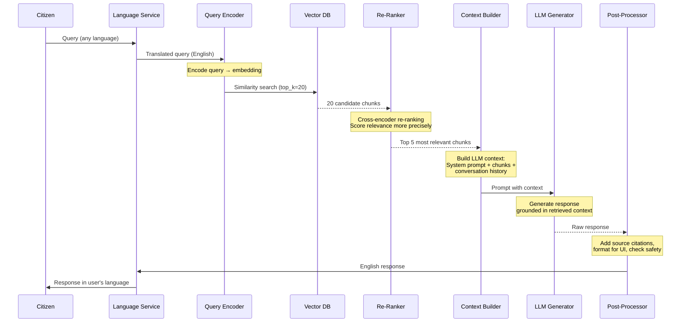
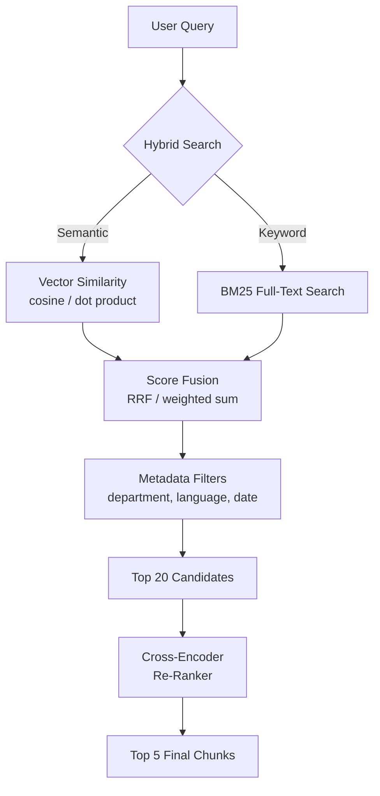
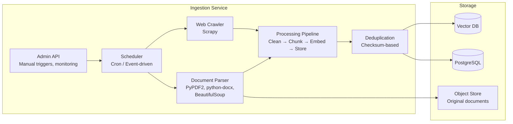
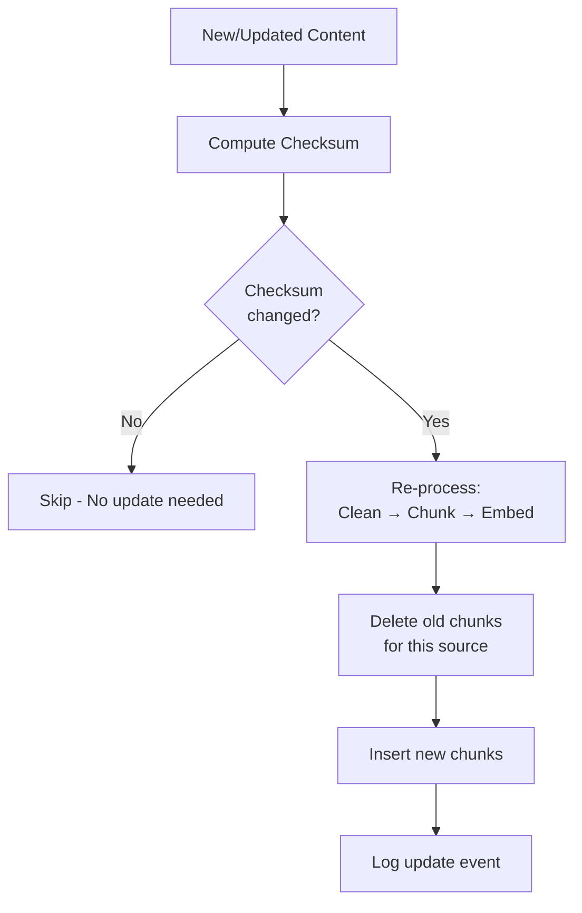
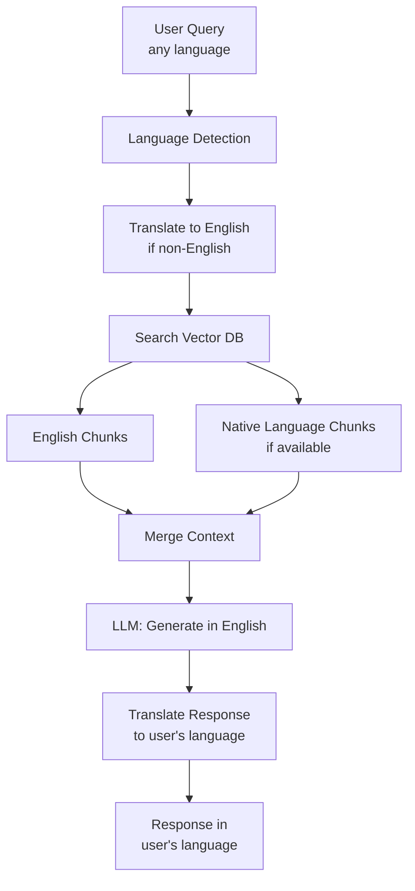
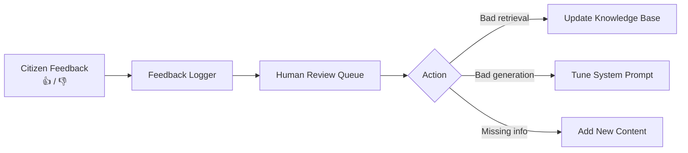

# Knowledge Ingestion & RAG Pipeline – High-Level Design (HLD)

**GHMC AI-Enabled Digital Services Platform**
**Version:** 1.0 | **Date:** 2026-02-27 | **Status:** Draft / Reference

---

## 1. Overview

This document describes the **Knowledge Ingestion** and **Retrieval-Augmented Generation (RAG)** pipeline that powers the GHMC AI Chatbot. The pipeline:

1. **Ingests** GHMC website content, government documents, policies, and schemes into a searchable knowledge base
2. **Retrieves** semantically relevant information in response to citizen/official queries
3. **Generates** contextual, accurate, multilingual responses using LLMs

---

## 2. Pipeline Architecture



---

## 3. Ingestion Pipeline – Detailed Flow

### 3.1 Data Sources

| Source | Type | Update Frequency | Ingestion Method |
|---|---|---|---|
| GHMC website pages | HTML | Weekly crawl | Scrapy crawler |
| Government orders / circulars | PDF/DOCX | On publication | API / manual upload |
| Scheme details & service info | Structured DB | On change | DB connector |
| FAQs | HTML/Markdown | Monthly | Parser |
| Announcements / press releases | HTML | Daily | RSS / crawler |

### 3.2 Ingestion Flow



### 3.3 Chunking Strategy

| Parameter | Value | Rationale |
|---|---|---|
| **Chunk size** | ~500 tokens | Fits within LLM context; large enough for semantic coherence |
| **Overlap** | 100 tokens | Prevents information loss at chunk boundaries |
| **Strategy** | Recursive / Semantic | Split by headings first, then paragraphs, then sentences |
| **Metadata per chunk** | `{source_url, department, doc_type, language, date, section_heading}` | Enables filtered search by department/type |

### 3.4 Embedding Model Options

| Model | Dimensions | Languages | Pros | Cons |
|---|---|---|---|---|
| `text-embedding-3-small` (OpenAI) | 1536 | Multilingual | High quality, easy API | API cost, external dependency |
| `multilingual-e5-large` (Hugging Face) | 1024 | 100+ languages | Self-hosted, free | Needs GPU infrastructure |
| `text-embedding-3-large` (OpenAI) | 3072 | Multilingual | Highest quality | Higher cost |
| `IndicBERT` / `MuRIL` | 768 | Indian languages | Best for Telugu/Hindi/Urdu | Needs fine-tuning |

**Recommendation:** Start with `text-embedding-3-small` for speed; evaluate `multilingual-e5-large` or `MuRIL` for better Indian language performance.

---

## 4. RAG Pipeline – Query-Time Flow

### 4.1 End-to-End Query Flow



### 4.2 Retrieval Strategy



| Stage | Detail |
|---|---|
| **Semantic Search** | Query embedding vs. stored embeddings (cosine similarity) |
| **Keyword Search** | BM25 full-text search for exact term matches (handles proper nouns, form numbers) |
| **Hybrid Fusion** | Reciprocal Rank Fusion (RRF) to merge semantic + keyword results |
| **Metadata Filtering** | Optional filters: department, document type, date range, language |
| **Re-Ranking** | Cross-encoder model (e.g., `bge-reranker-v2-m3`) scores query-chunk relevance |
| **Final Selection** | Top 5 chunks passed to LLM as context |

### 4.3 Context Building

The LLM receives a structured prompt:

```
SYSTEM PROMPT:
You are GHMC AI Assistant, helping citizens and officials with information
about Greater Hyderabad Municipal Corporation services, policies, and procedures.
Answer ONLY based on the provided context. If the context doesn't contain
the answer, say "I don't have information about this. Please contact GHMC
helpline at 040-XXXXXXXX."
Always cite your sources.

CONTEXT (from knowledge base):
[Chunk 1] Source: ghmc.gov.in/building-permissions | Dept: Urban Planning
"Building permission applications require Form-B along with..."

[Chunk 2] Source: GO_123_2025.pdf | Dept: Revenue
"As per GO 123, property tax rates for residential buildings..."

[Chunk 3-5] ...

CONVERSATION HISTORY:
User: What documents do I need for building permission?
Assistant: You need the following documents: ...
User: How long does approval take?

CURRENT QUERY:
How long does the building permission approval take?
```

### 4.4 Response Post-Processing

| Step | Action |
|---|---|
| **Citation injection** | Map response sentences to source chunks; add `[Source: URL]` references |
| **Safety check** | Ensure no PII leakage, no hallucinated phone numbers/addresses |
| **Format** | Structure as markdown for rich UI rendering (bullets, links, tables) |
| **Confidence score** | Low-confidence → append "Please verify at GHMC office" disclaimer |
| **Translate** | Convert response to user's preferred language |

---

## 5. Vector Database Design

### 5.1 Schema

```sql
-- pgvector schema
CREATE TABLE knowledge_chunks (
    id UUID PRIMARY KEY DEFAULT gen_random_uuid(),
    content TEXT NOT NULL,
    embedding VECTOR(1536),  -- or 1024 for e5-large
    
    -- Metadata
    source_url TEXT,
    source_title TEXT,
    department TEXT,          -- e.g., 'Urban Planning', 'Revenue', 'Sanitation'
    doc_type TEXT,            -- e.g., 'webpage', 'pdf', 'go_circular', 'faq'
    language TEXT,            -- 'en', 'te', 'hi', 'ur'
    section_heading TEXT,
    publish_date DATE,
    
    -- Housekeeping
    ingested_at TIMESTAMP DEFAULT NOW(),
    updated_at TIMESTAMP DEFAULT NOW(),
    is_active BOOLEAN DEFAULT TRUE,
    checksum TEXT             -- To detect content changes
);

-- HNSW index for fast similarity search
CREATE INDEX ON knowledge_chunks 
    USING hnsw (embedding vector_cosine_ops)
    WITH (m = 16, ef_construction = 200);

-- Full-text search index for BM25
CREATE INDEX ON knowledge_chunks 
    USING gin (to_tsvector('english', content));

-- Metadata filter indices
CREATE INDEX ON knowledge_chunks (department);
CREATE INDEX ON knowledge_chunks (doc_type);
CREATE INDEX ON knowledge_chunks (language);
```

### 5.2 Scaling Strategy

| Scale | Solution |
|---|---|
| **< 100K chunks** | pgvector (PostgreSQL extension) – simple, single DB |
| **100K – 10M chunks** | Qdrant (dedicated vector DB) – faster, supports filtering |
| **> 10M chunks** | Pinecone / Weaviate – managed, auto-scaling |

---

## 6. Knowledge Ingestion Service

### 6.1 Architecture



### 6.2 Ingestion Modes

| Mode | Trigger | Use Case |
|---|---|---|
| **Scheduled** | Cron (daily/weekly) | Regular website crawl, news updates |
| **Event-driven** | Webhook / API call | New GO published, policy updated |
| **Manual** | Admin dashboard button | One-time bulk ingestion, corrections |
| **Incremental** | Checksum comparison | Only re-process changed content |

### 6.3 Update Strategy



---

## 7. Multilingual RAG Strategy

GHMC requires support for **Telugu, Hindi, Urdu, and English**. Here's how the RAG pipeline handles multilingual content:



| Approach | How | When to Use |
|---|---|---|
| **Translate-then-search** | Translate query to English → search English index | Default; simplest |
| **Multilingual embeddings** | Use `multilingual-e5-large` / `MuRIL` to encode all languages in same space | When native-language documents are prevalent |
| **Dual-index** | Maintain separate indices per language | When Telugu/Hindi content is large and distinct |

**Recommendation:** Start with **translate-then-search** (English-centric index), then evaluate multilingual embeddings if translation quality is a bottleneck.

---

## 8. Quality & Monitoring

### 8.1 RAG Quality Metrics

| Metric | How to Measure | Target |
|---|---|---|
| **Retrieval Recall@5** | % of relevant chunks in top 5 results | > 85% |
| **Answer Faithfulness** | LLM judge: is answer grounded in context? | > 90% |
| **Answer Relevance** | LLM judge: does answer address the query? | > 90% |
| **Hallucination Rate** | % of answers containing info not in context | < 5% |
| **Latency (P95)** | End-to-end query-to-response time | < 5 seconds |

### 8.2 Monitoring Dashboard

| Signal | Alert Threshold |
|---|---|
| Embedding service down | Immediate |
| Vector DB query latency > 2s | Warning |
| LLM API error rate > 5% | Critical |
| Knowledge base stale > 7 days | Warning |
| Low-confidence responses > 20% | Investigation |

### 8.3 Feedback Loop



---

## 9. Technology Summary

| Component | Technology | Notes |
|---|---|---|
| **RAG Framework** | LangChain / LlamaIndex | Pipeline orchestration, chunking, retrieval |
| **Vector DB** | pgvector (start) → Qdrant (scale) | Embedding storage and similarity search |
| **Embedding Model** | `text-embedding-3-small` (OpenAI) | Start here; evaluate multilingual alternatives |
| **Re-Ranker** | `bge-reranker-v2-m3` (Hugging Face) | Cross-encoder for precision |
| **Web Crawler** | Scrapy | Scheduled GHMC website crawling |
| **Document Parser** | PyPDF2, python-docx, BeautifulSoup | PDF, DOCX, HTML parsing |
| **LLM** | GPT-4o / Gemini 2.5 / Claude 4 | Response generation |
| **Translation** | IndicTrans2 / Google Translate | Telugu, Hindi, Urdu ↔ English |
| **Scheduler** | APScheduler / Celery Beat | Periodic ingestion jobs |
| **Monitoring** | RAGAS / custom evaluator | RAG quality metrics |
