# High-Level Design: AI-Powered Browser Automation Agent

> A vision-enhanced, agent-orchestrated browser automation system (Skyvern-style)

---

## Table of Contents

1. [System Overview](#1-system-overview)
2. [System Architecture Diagram](#2-system-architecture-diagram)
3. [Component Design](#3-component-design)
   * [Chrome Extension Layer](#31-chrome-extension-layer)
   * [Backend Local Layer](#32-backend-local-layer)
4. [End-to-End Request Flow](#4-end-to-end-request-flow)
5. [Agent Orchestration Loop](#5-agent-orchestration-loop)
6. [DOM vs Vision Strategy](#6-dom-vs-vision-strategy)
7. [Memory System Design](#7-memory-system-design)
8. [Session Lifecycle](#8-session-lifecycle)
9. [Communication Strategy](#9-communication-strategy)
10. [Action Abstraction Layer](#10-action-abstraction-layer)
11. [Observability and Error Handling](#11-observability-and-error-handling)
12. [Key Design Decisions](#12-key-design-decisions)

---

## 1. System Overview

This system enables AI-driven browser automation by combining a **Chrome Extension** (the browser-side agent) with a **Local FastAPI Backend** (the reasoning and orchestration engine). Rather than relying on brittle CSS selectors or hardcoded scripts, the system uses LLM reasoning to understand *intent*, making it resilient to layout changes across websites.

The agent stack is built on **Google Agent Development Kit (ADK)** — Google's official framework for building multi-step, tool-using agents. ADK provides the Planner→Executor→Evaluator loop, built-in `InMemorySessionService` for session state, and a clean tool-calling interface that maps directly onto browser actions.

**Core Design Philosophy:**

* Layout-agnostic automation via structured DOM abstraction + vision fallback
* Agent orchestration powered by **Google ADK** (Planner, Executor, Evaluator, Tool Router)
* Session memory managed by **ADK `InMemorySessionService`** — zero external dependencies for local setup
* Persistent agent loop: Plan → Execute → Evaluate → Replan
* Decoupled LLM reasoning from browser implementation via abstract ADK tool calls

---

## 2. System Architecture Diagram

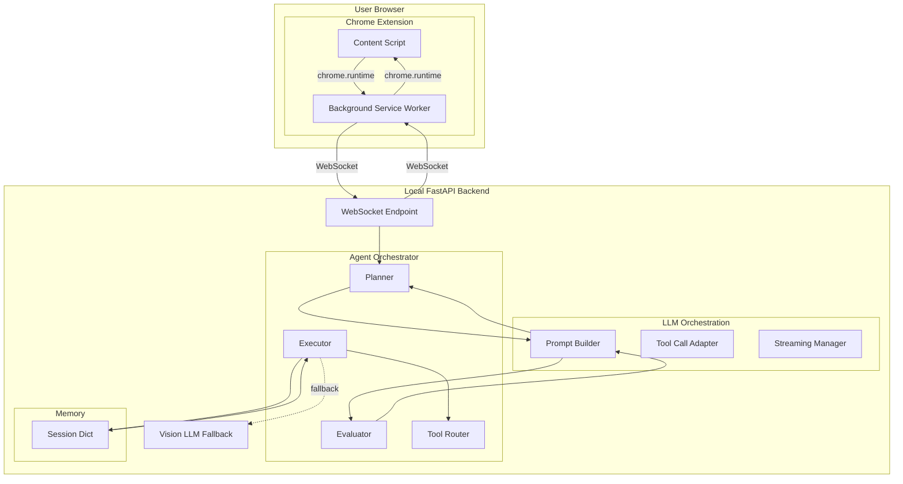

---

## 3. Component Design

### 3.1 Chrome Extension Layer

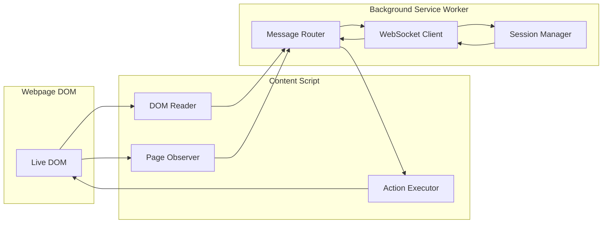

**Content Script** runs injected inside the webpage. It has direct access to the live DOM and is responsible for:

* Extracting a structured snapshot of visible elements: `{ text, role, bounding_box, clickable, selector }`
* Observing mutations so the backend always has an up-to-date view of the page
* Executing atomic browser actions dispatched from the backend

**Background Service Worker** runs persistently in the extension. It bridges the content script and the backend by:

* Maintaining the WebSocket connection and handling reconnection
* Routing messages to the correct tab when orchestrating multi-tab workflows

---

### 3.2 Backend Local Layer

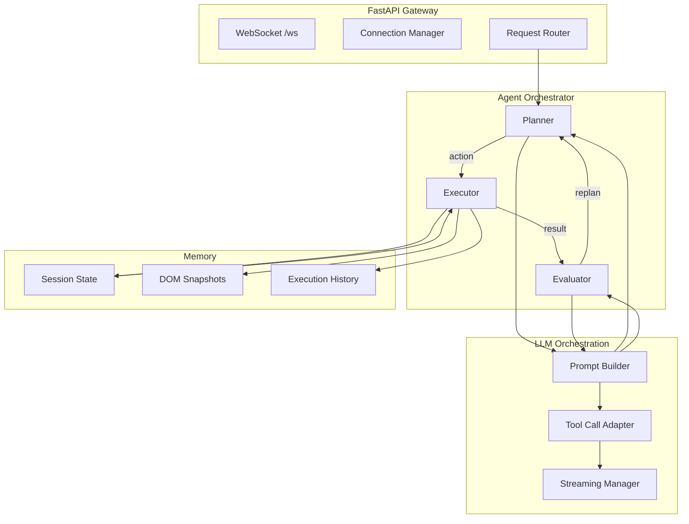

---

## 4. End-to-End Request Flow

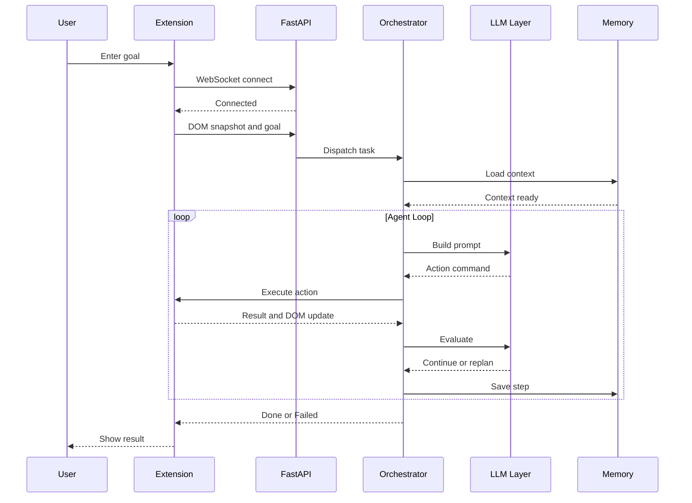

---

## 5. Agent Orchestration Loop

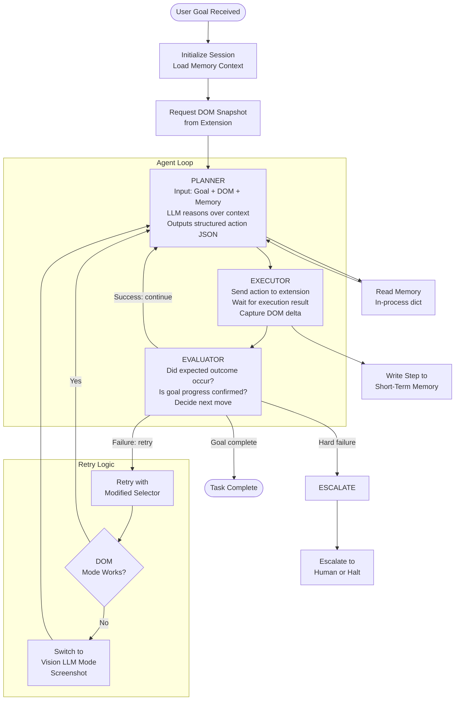

---

## 6. DOM vs Vision Strategy

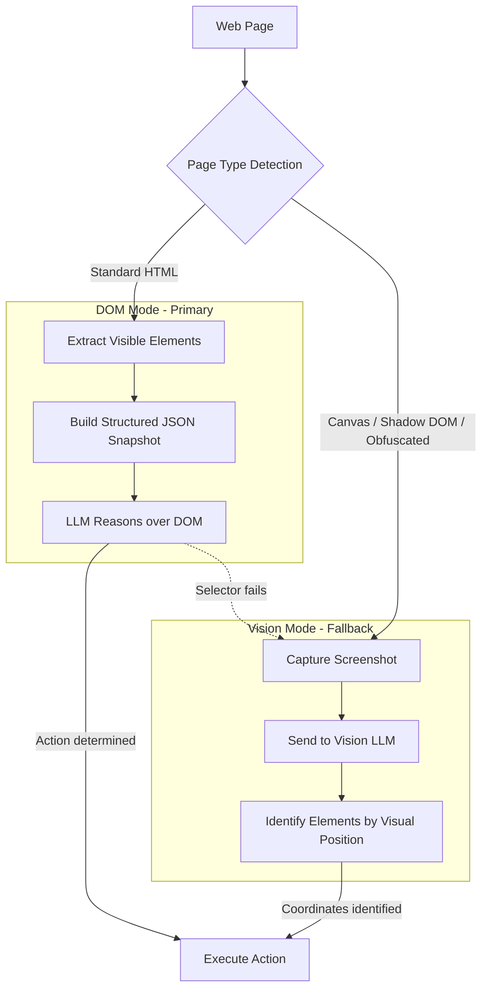

| Factor | DOM Mode | Vision Mode |
| --- | --- | --- |
| **Speed** | Fast | Slow - screenshot + inference |
| **Cost** | Low | Higher - vision model |
| **Robustness** | Moderate | High |
| **Use case** | Standard pages | Canvas, iframes, shadow DOM |

---

## 7. Memory System Design

> **Agent Stack:** Google ADK (`google-adk`) manages all session memory via its built-in `InMemorySessionService`. No external database or Redis is needed for local setup.

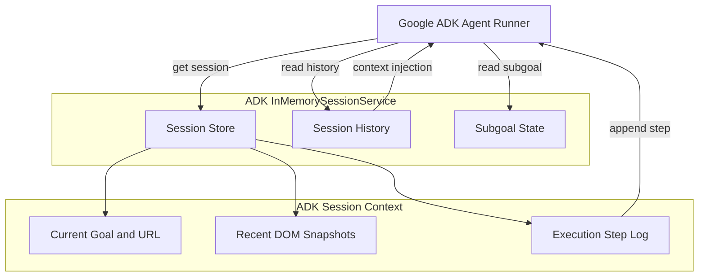

**Google ADK Memory primitives used:**

| ADK Class | Role |
| --- | --- |
| `InMemorySessionService` | Default session store — holds all active session state in-process |
| `Session` | Per-conversation context object passed to every agent turn |
| `Content` / `Part` | Structured message units stored in session history |
| `ToolContext` | Carries session reference into every tool call (browser action) |

> **Note:** For future cloud deployment, swap `InMemorySessionService` with ADK's `DatabaseSessionService` (PostgreSQL) or `VertexAISessionService` — zero code change to agent logic required.

---

## 8. Session Lifecycle

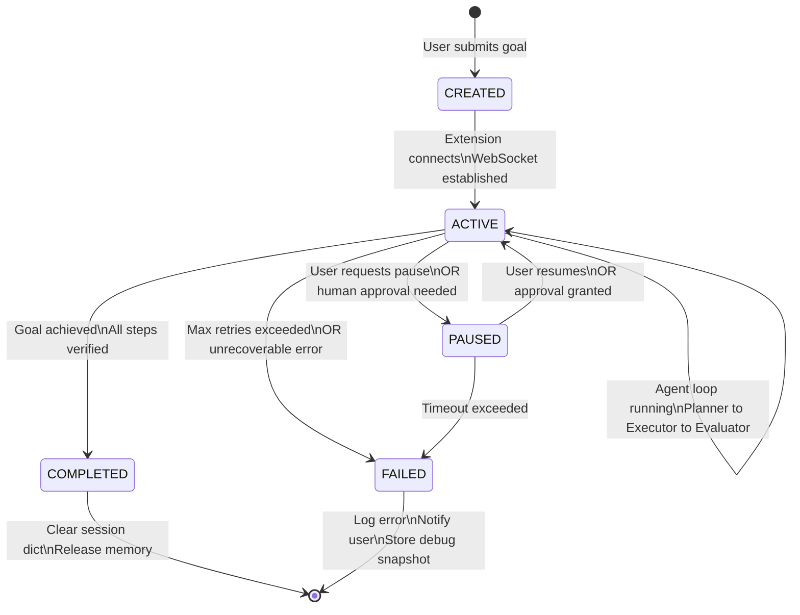

---

## 9. Communication Strategy

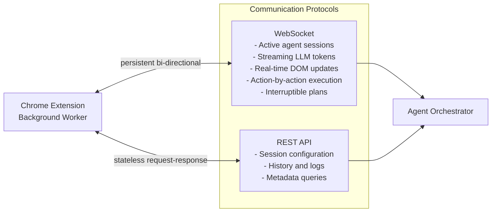

**Why WebSocket for active sessions?** The agent loop is inherently interactive — it streams LLM tokens, sends actions one-by-one, and must be interruptible if the user pauses or corrects the agent mid-task.

---

## 10. Action Abstraction Layer

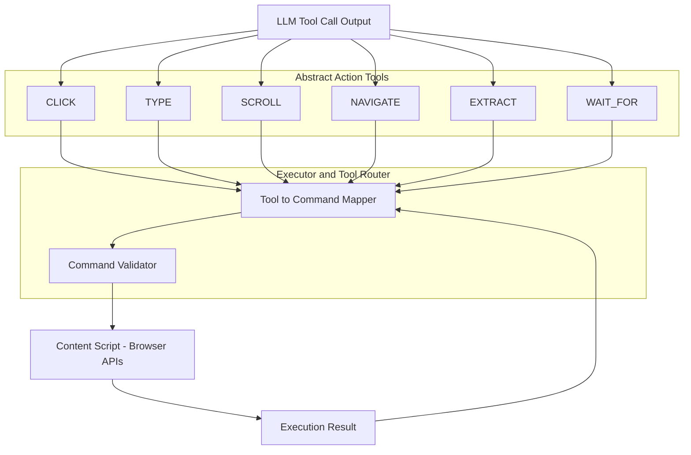

The action abstraction layer **decouples LLM reasoning from browser implementation**. The Planner outputs generic tool calls — the Executor translates them to browser-specific commands.

---

## 11. Observability and Error Handling

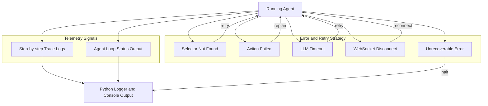

---

## 12. Key Design Decisions

| Decision | Choice | Rationale |
| --- | --- | --- |
| **Agent framework** | **Google ADK** (`google-adk`) | Official Google agent SDK — built-in Planner/Executor/Evaluator loop, tool calling, session service |
| **Extension to Backend protocol** | WebSocket | Bi-directional streaming, interruptible, low-latency for agent loops |
| **Primary page understanding** | Structured DOM abstraction | Fast, cheap, sufficient for 80%+ of standard web pages |
| **Vision fallback** | Screenshot + Vision LLM | Handles canvas, shadow DOM, obfuscated elements robustly |
| **Agent architecture** | ADK Planner - Executor - Evaluator loop | ADK enforces step verification before continuing; prevents runaway loops |
| **Action schema** | ADK Tool definitions (`@tool`) | ADK tool decorator maps LLM function calls directly to browser actions |
| **Short-term memory** | ADK `InMemorySessionService` | Zero-dependency in-process session store; drop-in swap to DB for production |
| **Long-term memory** | Not in local setup | Swap to ADK `DatabaseSessionService` or `VertexAISessionService` for cloud |
| **Backend** | Local FastAPI + uvicorn | Zero infra cost, simple to run, hosts ADK runner and WebSocket endpoint |
| **Async tasks** | asyncio + ADK async runner | ADK natively supports async agent execution via `Runner.run_async()` |
| **Observability** | ADK event stream + Python logging | ADK emits structured events per step; captures tool calls, LLM responses, errors |

---

## Appendix: Skyvern Extensions to Base Architecture

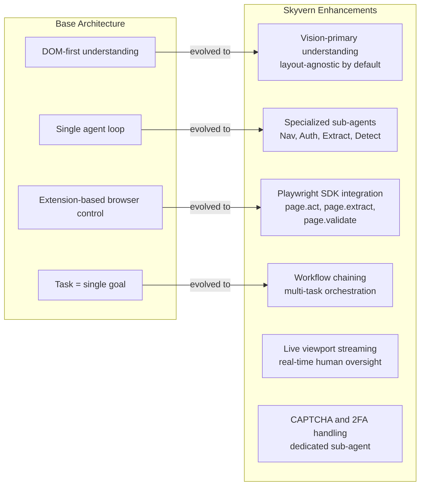

---

*Document version 3.0 — Local FastAPI + Google ADK setup. Covers system architecture, component design, ADK-powered agent orchestration, ADK InMemorySessionService, session lifecycle, and observability for an AI-powered browser automation platform.*
